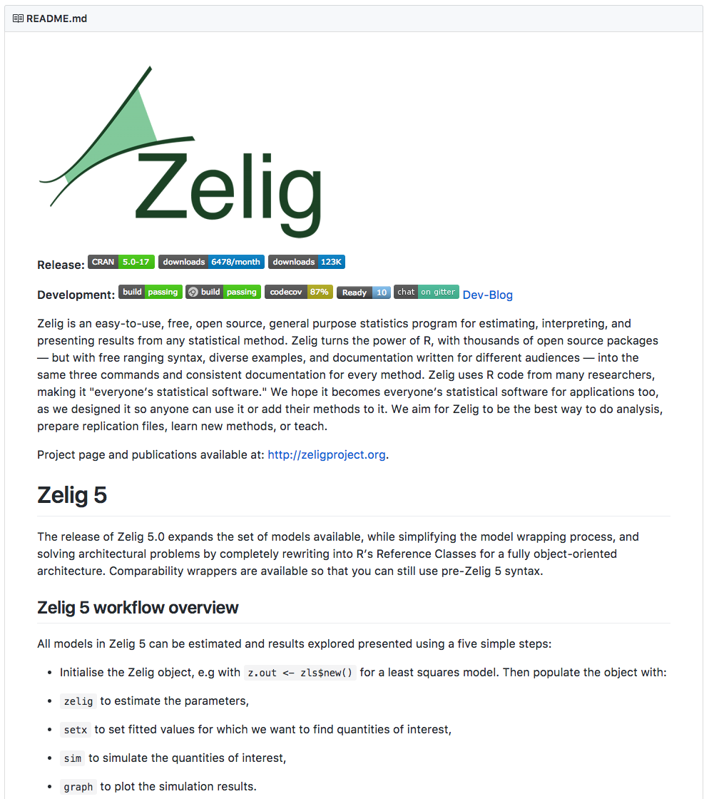

# Quick introduction to RMarkdown for dynamic README files

R packages ideally have a filed called *README.md* providing a *brief* introduction to the package. It should explains the package's purpose, basic syntax, and provide a simple quickstart example to get users started. The README should be **dynamically generated** and written in **Markdown**.

README files written in Markdown (with the `.md` file extension) are automatically rendered by GitHub and CRAN so that they are easy for your users to read. For example, here is a selection from the [Zelig R package README](https://github.com/IQSS/Zelig) rendered on GitHub:



# Markdown

(Almost) all of the source code files in your R package are plain text files. This includes the files you use to document why your package exists and how it works. As such, you need a [markup language](https://en.wikipedia.org/wiki/Markup_language) to give formatting instructions. For example, to give instructions about what line of your documentation is a header or what text to italicize. You are encouraged to use the [Markdown](https://en.wikipedia.org/wiki/Markdown) markup language for README files. Markdown is perhaps the easiest markup language to learn.

See [Adam Pritchard's Markdown Cheatsheet](https://github.com/adam-p/markdown-here/wiki/Markdown-Cheatsheet) for a quick introduction to Markdown.


# Dynamic README generation

README files ideally include examples that users can easily run in their own console to get a feel for how the package works. These examples should include output, so that users can compare output on their own computer to the expected output. The examples should also run without error.

To dynamically generate examples in your README file use [R Markdown](http://rmarkdown.rstudio.com/lesson-2.html). R Markdown allows you to include executable "code chunks" into a Markdown document. These code chunks can be run and the output included in the final document.

To use R Markdown for your *README*, write your documentation and code chunks in a file called *README.Rmd*. `init_iqss_package` from the [**IQSSdevtools**](https://github.com/IQSS/IQSSdevtools) R package automatically creates this file. Only edit the *README.Rmd* file, not the *README.md* as the latter will be generated from *README.Rmd* automatically when in R you run either:

```r
IQSSdevtools::build_iqss_package()
```

or to render only the README and not the whole package:

```r
rmarkdown::render('README.Rmd')
```

# Code chunks in R Markdown


To add executable code in your *README.Rmd* include three backticks ``` followed by `{r}`. You can include [code chunk options](https://yihui.name/knitr/options/) inside of the curly brackets `{}` to specify how the chunk is run. Then on a new line include the code you want to execute. Close the chunk with another three backticks. For example:

```
    ```{r}
    library(MyPackage)

    x <- 1:10
    a_function(x)
    ```
```

[This RStudio website](http://rmarkdown.rstudio.com/lesson-3.html) has more information on writing code chunks.
