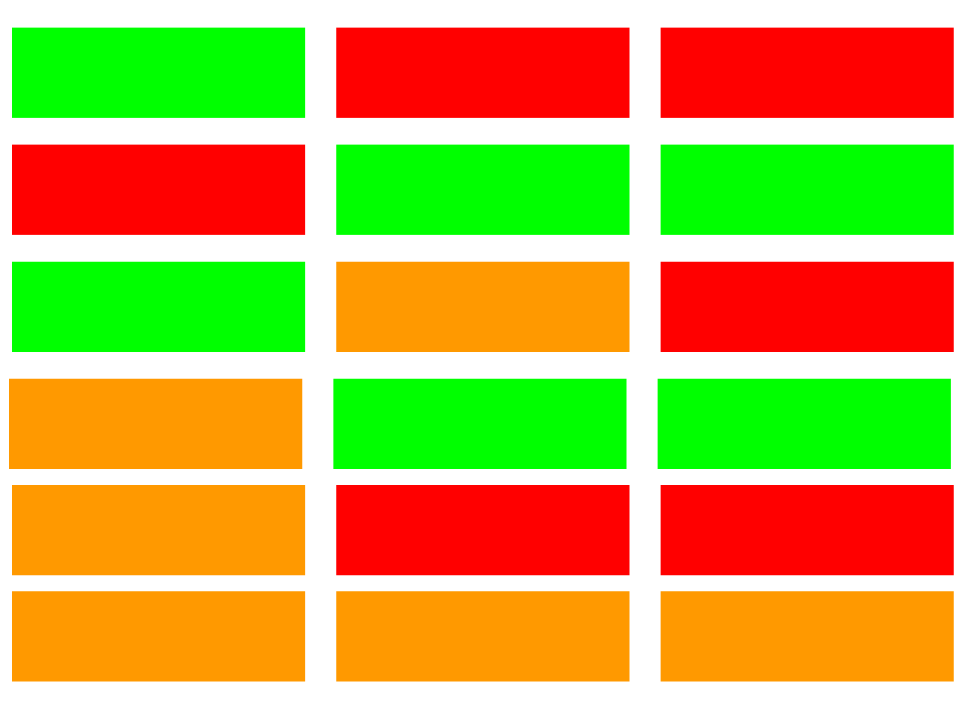

[](https://github.com/IQSS/social_science_software_toolkit/blob/master/report_card/iqss_report_card_spec.md)

# IQSS Report Card Specification

|              |                     |
| ------------ | ------------------- |
| Authors      | Christopher Gandrud |
| Version      | 0.0.0.9000          |
| Last Updated | 2017-03-28          |
| Created      | 2017-03-28          |

## Goals

An IQSS Report Card reports the extent to which a piece of statistical software is *minimally* compliant with the [IQSS Best Practices for Social Science Statistical Software Development](https://github.com/IQSS/social_science_software_toolkit/blob/master/iqss_sss_best_practices.md).

## Changelog

All changes to the spec after version 0.0.0.9000 are reported in the [Changelog](changelog.md).

## File name and format

An IQSS Report Card is a [YAML formatted file](http://yaml.org/) with the name *.iqss_reportcard.yml*. Note that YAML files can be parsed as JSON or XML.

## Parent Nodes

All IQSS Report Cards **must** have the following parent nodes:

```yaml
Documentation
License
Version_Control
Testing
Background
```

## Child Nodes

An IQSS Report Card **may** have the following child nodes. Typically different child nodes will be applicable to software written in particular languages.


### Documentation

The `Documentation` parent node **may** contain the following fields:

| Name              | Description | Language |
| ----------------- | ----------- | -------- |
| `readme`          | A README file explaining the software's aims and with a quickstart example | all |
| `changelog`       | Document detailing all changes per release | non-R |
| `NEWS`            | Document detailing all changes per release | R |
| `bugreports`      | URL for public location to make bug reports | all |
| `vignettes`       | Longform documentation with detailed descriptions | R |
| `website`         | A website dynamically generated documentation website | non-R |
| `pkgdown_website` | A website dynamically generated with the [pkgdown](https://github.com/hadley/pkgdown) package | R |
