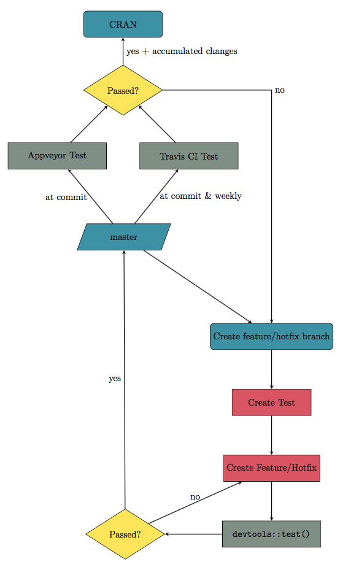

# Recommended testing tools and process for R packages

## What is a test?

There are many different types of software tests--unit tests, integration tests, require tests, failure tests, and so on. All of these type of tests have the same broad structure: the tester defines some expectation, the code is executed, and the output is compared to the expectation. If the expectation and output match, then the test passes.

## What is a high quality test?

How do you know if you are testing well? Ideally you want to test as many possible user and program behaviors as possible, i.e. have a broad *testing surface*. This will help you identify problems before your code ships. One proxy for the testing surface is *code coverage*. Code coverage is the percent of a programs code that is executed by a suite of tests.

Code coverage, however, is an imperfect proxy for test quality. The quality of your tests depends on the quality of the expectations they are testing. For example, imagine you created a function that you want to use to find the mean value of a vector of numbers. You creat the function:

```R
my_mean <- function(x) {
    mean <- x
    return(mean)
}
```

And you create a test:

```R
testthat::expect_error(my_mean(1:10), NA)
```

This test will have 100% code coverage as every line of `my_mean` will be executed when the test is run. However, it is a low quality test. The implicit expectation is that `my_mean` finds the mean of a vector of numbers. However `my_mean` doesn't do this. It will just return the original vector of numbers, not their mean. The test does not included the expectation. Instead the expectation it tests is that no error will be returned.

A better tests, that explicitly includes our expectation about the function's behavior would be:

```R
testthat::expect_equal(my_mean(1:10), 5.5)
```

This test expliticly expects `my_mean` to return the mean of a vector of integers 1 through 10: 5.5.

In sum, when designing your tests you should aim for high code coverage and high quality expectations.

## Tools

Setting up an effective testing suite for R can involve the following tools:

-   [roxygen2](https://CRAN.R-project.org/package=roxygen2) R package

-   [devtools](https://CRAN.R-project.org/package=devtools) R package

-   [testthat](https://CRAN.R-project.org/package=testthat) R package

-   [covr](https://CRAN.R-project.org/package=covr) R package

-   one or more continuous integration service such as [Travis CI](https://travis-ci.org/) and [Appveyor](https://www.appveyor.com/)

## Setup steps

If you **have not initialized** you package, they you can use the `init_iqss_package` function from the IQSSdevtools package to initialize a skeleton package with the infrastructure needed to create a test suite. This will include:

-   A *test* directory in your package containing

    -   a *testthat.R* file setting up the tests, including loading needed packages.
    -   *testthat* directory for R files with tests.

-   *.travis.yml* and *appveyor.yml* files needed to set up continuous integration on [Travis CI](https://travis-ci.org/) (for Linux and macOS) and [Appveyor CI](https://www.appveyor.com/) (for Windows).

You can set up a testing suite at any time in an R package development process using the following steps:

1.  Include **executable examples** in your documentation with the roxygen2 `@examples` tag. These examples will be run when you `check` the package. Note that the implicit expectation when using executable examples as tests is that they don't fail. This is a weak expectation.

2.  Set your package's folder as the working directory and **initialize a unit test skeleton** with `add_test_suit` from the IQSSdevtools package.

# Development process

Once you have the testing suite set up, you should follow a "test-first" development process characterised in the following figure:


## Further reading

-   [Failing Faster](http://slides.com/christophergandrud/failing-faster#/): presenation by Christopher Gandrud from 22 March 2017 on testing with R packages

-   Hadley Wickham's [chapter](http://r-pkgs.had.co.nz/tests.html) on testing R packages
